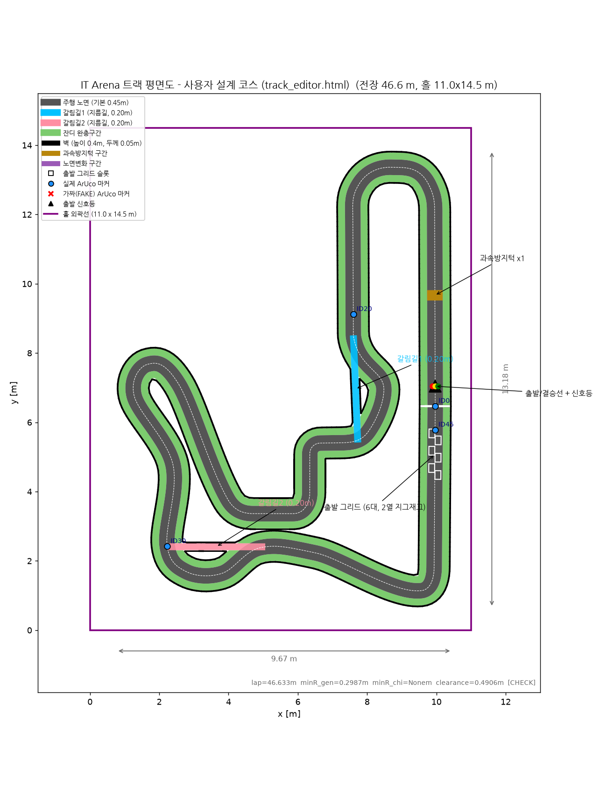

# ISTech IT Arena

**6개 과학기술특성화대학(KAIST · POSTECH · UNIST · DGIST · GIST · KENTECH) 로봇 동아리 연합 자율주행 RC카 레이싱 대회**

- 📅 **2026년 11월 14일 (토)** · 📍 포항 (POSTECH)
- 🏁 규정 차량(15×20cm)이 신호등을 스스로 인식해 출발, 갈림길·과속방지턱이 있는 서킷을 자율주행으로 완주하는 시간제 레이스

## 이 저장소가 대회의 공식 공유소입니다

대회 규칙, 트랙 파일, 회의 기록이 전부 여기서 관리됩니다. **디스코드는 실시간 소통용, 여기는 공식 기록용**입니다.

| 찾는 것 | 위치 |
|---|---|
| 대회 규칙 · 일정 · 패널티 · 예산 | [**MANUAL.md**](MANUAL.md) |
| **PDB(전원 모듈) 사양 · 데이터시트** | [**docs/hardware/power-modules.md**](docs/hardware/power-modules.md) |
| 트랙 맵 파일 (시뮬레이터 · 시공용) | [**track/**](track/) — 사용법과 **ArUco 검출 주의사항**은 [track/README.md](track/README.md) |
| 파일 통째로 다운로드 | [**Releases**](../../releases) 에서 zip — 항상 최신 릴리즈를 받으세요 |
| 질문 · 파일 문제 제보 · 규칙 제안 | [**Issues**](../../issues) — 아래 "이슈 사용법" 참고 |
| 회의 기록 | [**meetings/**](meetings/) |
| GitHub이 처음이라면 | [**docs/github-guide.md**](docs/github-guide.md) |

### 🔧 차 만들기 전에 꼭 볼 것

처음 오셨거나 이제 부품을 주문하신다면 이 네 가지만 먼저 보세요.

1. **[전원 모듈(PDB) 사양](docs/hardware/power-modules.md)** — 지급되는 보드 2장은 역할이 다릅니다.
   입출력이 전부 **XT-30 암 커넥터**라 케이블은 각 팀이 준비해야 하고,
   보드가 **10 × 14 cm × 2장**이라 차체 바닥을 거의 다 씁니다.
2. **[예산 집계 방식](MANUAL.md)** — 3만원 이상 물품 합산 30만원. 모터·센서류는 금액과 무관하게 포함.
3. **[ArUco 검출 주의사항](track/README.md)** — OpenCV 기본 설정으로는 멀쩡한 마커를 놓칩니다.
   마커 크기도 **판 10 cm / 코드 7 cm**로 다릅니다.
4. **[원격 비상정지 요건](MANUAL.md)** — 의무 장비입니다. 하드웨어·소프트웨어 스위치 각 1개 이상.

## 이슈(Issues) 사용법

궁금한 것, 이상한 것, 바꾸고 싶은 것이 있으면 [이슈를 올리세요](../../issues/new/choose). 세 가지 종류가 있습니다.

1. **❓ 질문** — 규칙 해석, 트랙 파일 사용법, 기술 질문. 운영진이 답변을 달고, 답변이 곧 공식 해석이 됩니다.
2. **🐛 파일/트랙 문제** — 맵 파일이 안 열린다, 수치가 회의 결정과 다르다, 시뮬에서 이상하다 등. 스크린샷을 꼭 붙여주세요.
3. **💡 규칙 제안** — 규칙 추가/변경 제안. 바로 결정되지 않고 **다음 대표자 회의 안건으로 수합**됩니다.

원칙:
- 다른 팀에게도 해당될 질문이면 디스코드 대신 **이슈로** — 답변이 기록으로 남아 모두가 봅니다.
- 이슈 하나에 주제 하나. 제목만 봐도 내용을 알 수 있게.
- 해결된 이슈는 운영진이 닫습니다(closed). 닫혀도 기록은 검색됩니다.

## 업데이트 받는 법

- 저장소 우측 상단 **Watch** 를 눌러두면 규칙/트랙 변경 시 알림이 옵니다 (강력 추천).
- 트랙 파일이 바뀌면 새 **Release** 가 올라오고, 무엇이 왜 바뀌었는지 릴리즈 노트에 적힙니다.
- git을 쓸 줄 알면 `git pull` 한 번이면 됩니다.

## 참여 동아리

MR (KAIST) · Power-on (POSTECH) · Pinocchio (UNIST) · ROD (DGIST) · Dgroid (DGIST) · ISAAC (GIST) · MeKENic (KENTECH, 심판)

## 운영

- 총괄: 이윤혁 (POSTECH) / 저장소 관리: 안연수 (KAIST, MR)
- 대회 관련 결정은 대표자 회의에서 이루어지며, 결정 사항은 [MANUAL.md](MANUAL.md)와 [meetings/](meetings/)에 반영됩니다.
