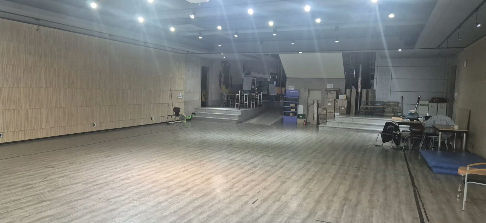
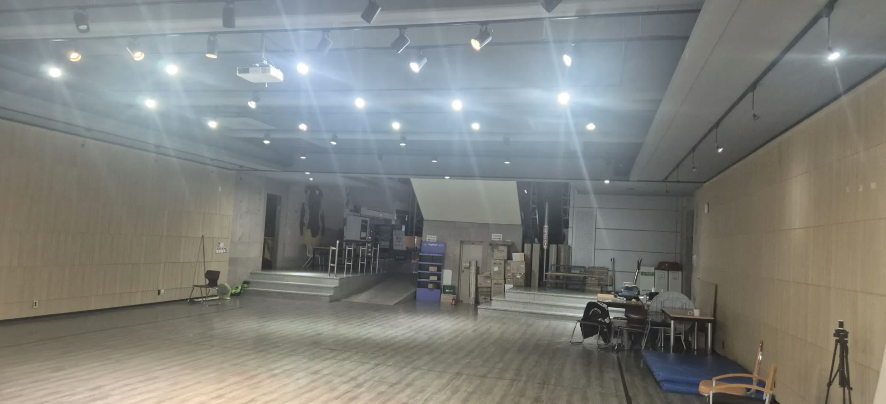
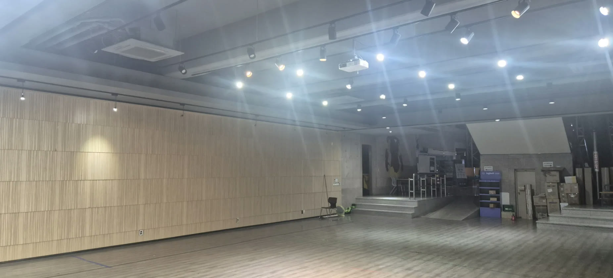
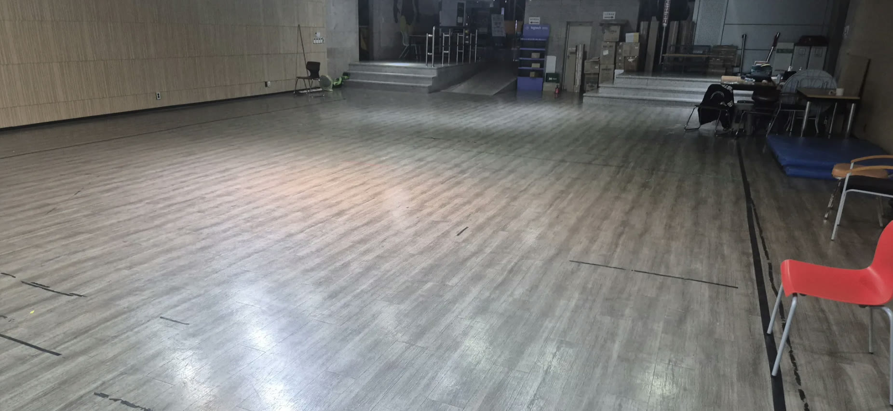

# 경기장 사진 — 조명 조건

**출처:** power-on (POSTECH) · 공유 2026-10-06 (이슈 #6 / 2차 회의 준비 분담 항목)

대회장 홀은 **11.0 × 14.5 m**입니다. 바닥과 벽은 **포맥스/EVA폼으로 덮습니다.**
아래 사진은 **덮기 전 원래 상태**이며, 조명 조건을 확인하는 용도입니다.

> ⚠️ **lux 실측값은 없습니다.** 사진으로 충분하다고 판단해 **별도로 요청하지 않기로 했습니다.**
> 아래 서술은 사진에서 보이는 것을 적은 것이고 측정값이 아닙니다.

---

## 핀조명 전체 점등

경기는 **조명을 전부 켠 상태로 진행**합니다. 전부 켜야 차량이 제대로 주행할 수 있다는 판단입니다 (2026-10-06 회의). **비전은 이 상태를 기준으로 맞추세요.**

## 천장 조명 배치

천장에 **다운라이트와 트랙 스포트라이트(핀조명)가 섞여** 있습니다. 에어컨 카세트와 프로젝터도 함께 달려 있습니다.

## 조명을 줄인 상태의 바닥

---

## 개발에 참고할 점

### 1. 밝기가 공간적으로 고르지 않습니다

조명이 지향성 스포트라이트라 **바로 아래는 밝고 사이는 어둡습니다.** 한 랩을 도는 동안 노출 조건이 크게 바뀝니다.

→ **고정 노출·고정 화이트밸런스는 위험합니다.** 자동 노출을 쓰거나, 밝기 변화에 강인한 전처리를 넣으세요.

### 2. 바닥 반사가 강합니다

원래 바닥이 광택 있는 목재 무늬 마감이라 **스포트라이트가 바닥에 밝은 반점으로 맺힙니다.** 포맥스/EVA폼으로 덮을 예정이지만, **덮개 표면도 재질에 따라 반사할 수 있습니다.**

→ 노면 임계값을 반사광 기준으로도 검증해 보세요. 각 학교에 지급된 **1×1 m 폼으로 테스트베드를 만들 때 비슷한 조명 아래서 확인**하는 것을 권합니다.

### 3. 바닥에 직선 이음새가 있습니다

바닥재 이음새가 **검은 직선**으로 드러나 있습니다 (마지막 사진에서 잘 보입니다). 포맥스/EVA폼으로 덮이는 구간은 문제가 없지만, **덮개 바깥이 카메라에 들어오면 차선으로 오인될 수 있습니다.**

### 4. 홀 안쪽에 단차 구역이 있습니다

안쪽에 **계단과 경사로가 있는 단상**이 있습니다. 트랙은 평면 구역에 설치되지만, **배경으로 들어오는 구조물**이라 ArUco 검출이나 벽 인식에 영향을 줄 수 있습니다.

### 5. 적재물은 치워집니다

사진 우측의 테이블·의자·박스는 **대회 당일 모두 치워집니다** (2026-10-06 회의 확인).

---

## 확인되지 않은 것

- 트랙을 깔고 **포맥스/EVA폼 덮개를 올린 뒤의 실제 노면 밝기** — 각 팀 테스트베드에서 직접 확인해 보세요
- lux 실측값은 **요청하지 않기로 했습니다.** 필요하시면 이슈로 올려주세요
