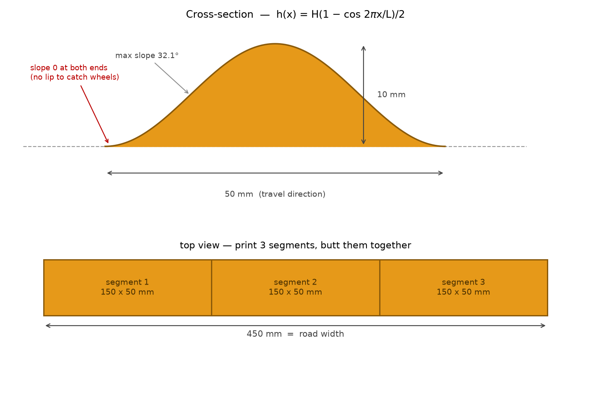
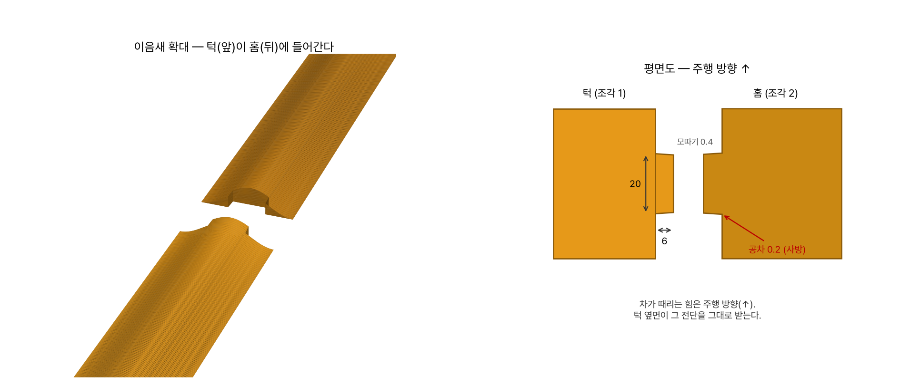
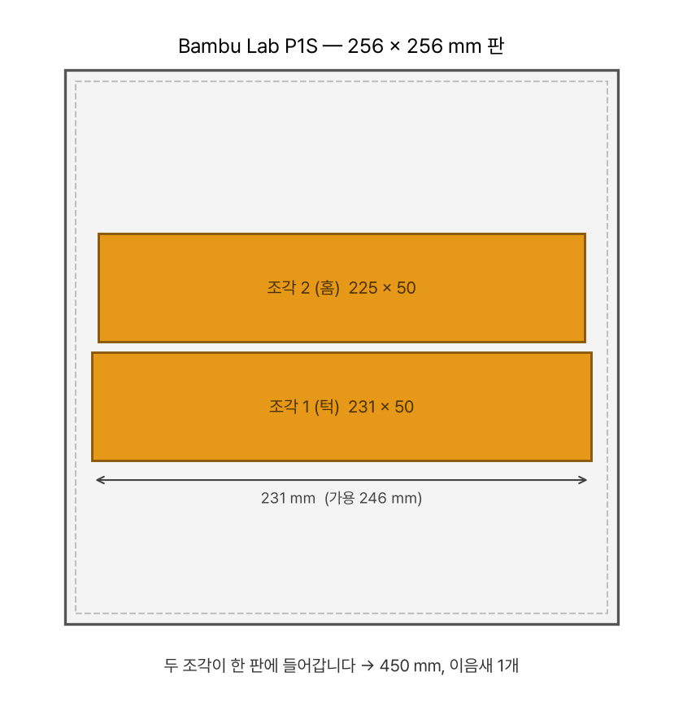

# 과속방지턱 — 제작 파일 및 지침

**이슈 [#2](../../issues/2)** · 트랙 패키지 v2026.10.10 기준

시뮬레이터(`track/output_final/world.sdf`)의 `bump_0`은 **450 × 50 × 10 mm** 박스입니다.
여기 실물은 **그 외형 안에 들어가므로**, 설치 위치와 `venue_layout.dxf`를 그대로 쓰면 됩니다.



| 항목 | 값 |
|---|---|
| 전체 크기 | **450 × 50 × 10 mm** (도로 폭 전체 × 주행 방향 × 높이) |
| 단면 | 반코사인 `h(x) = H(1 − cos 2πx/L)/2` |
| 최대 경사 | **32.1°** |
| 양 끝 기울기 | **0** — 진입·탈출에 턱이 없습니다 |
| 수량 | **1개** (트랙의 과속방지턱 구역) |

> **왜 박스가 아니라 곡면인가** — 시뮬은 박스로 모델링돼 있지만, 실물을 그대로 박스로 만들면
> 진입면이 **수직벽**이 되어 작은 바퀴가 걸립니다. 같은 외형 안에서 곡면으로 만들면 넘어갈 수
> 있고, 시뮬 박스는 그보다 **보수적인(더 가혹한) 근사**가 됩니다.

## 파일

| 파일 | 용도 |
|---|---|
| `speed_bump_225mm_h10_1_of_2.stl` | **권장.** 턱 쪽 조각 (231 × 50 × 10 mm) |
| `speed_bump_225mm_h10_2_of_2.stl` | **권장.** 홈 쪽 조각 (225 × 50 × 10 mm) |
| `speed_bump3_150mm_h10_*_of_3.stl` | 3분할 한 벌 (턱 / 턱+홈 / 홈) — 베드가 작은 경우 |
| `make_speed_bump.py` | 생성기. 높이·분할 수·공차를 바꿔 다시 뽑을 수 있습니다 |

## 이음새 — 턱 + 홈, 위아래까지 가둠



맞대기만 해서는 안 됩니다. 이음새가 받는 힘은 두 가지입니다.

| 방향 | 무엇이 받는가 |
|---|---|
| **주행 방향 (x) 전단** | 차가 방지턱을 때리는 힘. **턱 옆면**이 받습니다 |
| **위아래 (z)** | 한 조각만 들리면 이음새에 **단차**가 생깁니다. 아래는 **노면**이, 위는 **홈 천장**이 막습니다 |
| 폭 방향 (y) | 차가 주는 하중이 아닙니다. **양면테이프**가 맡습니다 |

**턱을 단면 전체 높이로 내면 x만 잡고 z는 못 잡습니다.** 그래서 턱을 **높이 4 mm만** 내고,
홈은 **4.2 mm까지만 파서 천장을 남겼습니다.** 천장이 턱 위를 덮으므로 조각이 위로 들리지 못하고,
아래로는 노면이 받칩니다.

| 항목 | 값 |
|---|---|
| 턱 크기 | **14 × 6 × 4 mm** (주행 × 폭 × 높이) |
| 홈 | 14.4 × 6.2 × **4.2 mm** — 천장 있음 |
| 공차 | **0.2 mm** — 사방 |
| 모따기 | **0.4 mm** — 들어가는 길잡이 |
| 천장 위 살 두께 | **3.9 mm** |
| 천장 브리지 폭 | **6.2 mm** |

### 강도 — 부러지지 않습니다

차량 2.5 kg(젯슨 + 6S + 모터 포함)이 32.1° 경사를 밀어 올릴 때 수평 반력은 **15.4 N**입니다.
충격 동적 계수를 10배 잡아도 154 N입니다. 아래는 **200 N**으로 계산한 값입니다.

| 부위 | 응력 | PLA 기준 | 안전계수 |
|---|---:|---:|---:|
| 턱 전단 (24 mm²) | 8.3 MPa | 25 MPa (층간) | **3.0배** |
| 턱 뿌리 굽힘 (Z = 131 mm³) | 9.2 MPa | 70 MPa | **7.6배** |
| 홈 벽 지압 (26 mm²) | 7.7 MPa | 60 MPa | **7.8배** |

굽힘으로 부러지는 하중은 **약 1,520 N** — 정적 반력의 99배입니다.

**적층 방향도 유리합니다.** 바닥에 눕혀 찍으므로 적층면이 수평인데, 턱에 걸리는 힘은
주행 방향(x) 즉 **적층면 안쪽**이라 층이 벌어지는 방향이 아닙니다. 가장 약한 층간 강도를
그대로 써도 안전계수 3배입니다.

> 실제로는 두 조각이 **각자 노면에 고정**되어 있어 턱은 그 '차이'만 전달합니다. 위 값은 한쪽이
> 전혀 안 붙어 있다고 가정한 상한입니다. 먼저 뜯어지는 것은 턱이 아니라 **테이프**입니다.

### 좌우(폭 방향)로 빠지지 않나 — 기하로는 안 잡습니다

**맞습니다. 턱을 −y로 당기면 그냥 빠집니다.** 일부러 그렇게 뒀습니다.

폭 방향까지 물리려면 **언더컷**(도브테일 등)이 있어야 하는데, 그러면 **위에서 아래로 끼워야만**
조립됩니다. 그런데 z를 잡아 주는 **홈 천장**이 바로 그 경로를 막습니다. **둘은 동시에 못 씁니다.**
눕혀 출력하는 한 하나를 골라야 합니다.

**z를 고른 이유는 테이프의 성질 때문입니다.**

| 방향 | 테이프가 받는 방식 | 테이프 강도 |
|---|---|---|
| 폭 방향(y) 분리 | **전단** | 강함 |
| 위로 들림(z) | **박리(peel)** | 약함 |

양면테이프는 **전단에 강하고 박리에 약합니다.** 그러니 테이프가 잘하는 y는 테이프에 맡기고,
테이프가 못하는 z를 기하가 막는 것이 맞습니다. 지금 설계가 정확히 그렇게 되어 있습니다.

게다가 **차가 주는 힘에 폭 방향 성분이 없습니다.** y로 빠지는 건 운반·설치 중에나 생기는 일이고,
노면에 붙이고 나면 두 조각 모두 고정됩니다.

> **그래도 기하로 물리고 싶다면** 알려주세요. 도브테일(위에서 끼움) 버전을 낼 수 있습니다.
> 대신 홈 천장이 사라져 **z는 테이프에만 의존**하게 됩니다. 저는 지금 쪽을 권합니다.

### 출력상 주의

- **턱 쪽 조각은 오버행이 없습니다.** 턱이 바닥(z=0)에서 올라오므로 그냥 찍힙니다.
- **홈 쪽 조각은 천장이 6.2 mm 브리지**입니다. FDM에서 흔한 폭이라 서포트 없이 찍힙니다.
  천장 아랫면이 조금 거칠게 나오는데, **공차 0.2 mm 안에서 흡수되는 수준**이고 보이지 않는 면입니다.
  신경 쓰이면 슬라이서의 브리지 설정만 켜 두세요.

**빡빡하거나 헐겁다면 공차만 바꿔 다시 뽑으세요.**

```bash
python3 make_speed_bump.py --segments 2 --clearance 0.15   # 더 빡빡하게
python3 make_speed_bump.py --segments 2 --clearance 0.30   # 더 헐겁게
```

> 0.2 mm는 FDM·PLA에서 **손으로 밀어 넣어지되 흔들리지 않는** 정도를 노린 값입니다.
> 공차는 **홈에만** 들어가므로(턱은 설계 치수 그대로), 다시 뽑을 때 **홈 조각만** 바꾸면 됩니다.

### 프린터별 분할



| 프린터 | 조형 공간 | 권장 |
|---|---|---|
| **Bambu Lab P1S / P1P / X1C** | 256 × 256 × 256 | **2분할** — 231 mm·225 mm 두 조각이 한 판에 (231 × 105 mm) |
| Prusa MK4 / Ender 3 계열 | 220~250 | 2분할 (231 mm 들어가는지 확인) 또는 3분할 |
| 소형기 (180 이하) | — | 3분할 (156 mm·150 mm) |

**턱이 6 mm 튀어나오므로 턱 조각은 231 mm**입니다. P1S 가용 246 mm 안에 들어갑니다.
450 mm 통짜는 P1S에 들어가지 않습니다.

```bash
python3 make_speed_bump.py --selftest          # 메시 + 공차 + 가상 조립 검증
python3 make_speed_bump.py --segments 2        # 기본 (P1S 권장)
python3 make_speed_bump.py --segments 3        # 3분할
python3 make_speed_bump.py --height 5          # low  (--bump-height low)
python3 make_speed_bump.py --clearance 0.15    # 공차 조정
```

의존성이 없습니다. 표준 라이브러리만 씁니다.

## 출력 설정

| 항목 | 권장 |
|---|---|
| 재질 | **PLA** — 모든 동아리가 쉽게 뽑을 수 있는 재질로 골랐습니다 |
| 서포트 | **불필요** |
| 바닥 | 평면이라 그대로 베드에 올립니다. 브림 권장 |
| 레이어 | 0.2 mm |
| 인필 | 20 % 이상. 밟혀도 눌리지 않을 정도면 됩니다 |
| 사용량 | 3조각 합계 솔리드 부피 **112.5 cm³** (인필 20 % 기준 대략 **90~110 g**) |

### 🎨 색 — 대회용은 주황, 테스트용은 자유

**색을 맞춰야 하는 것은 대회장에 깔리는 1개뿐이고, 그건 운영진이 만듭니다.**
각 팀이 색을 맞출 필요는 없습니다.

| 구분 | 수량 | 색 |
|---|---|---|
| **대회용 실물** | 1개 (운영진 제작) | **주황 `#E69919`** — 시뮬 RGB `0.9, 0.6, 0.1`과 동일 |
| **각 팀 테스트용 사본** | 자유 | **아무 색이나** 괜찮습니다 |

흰색이든 검정이든 **기계적 거동은 완전히 같습니다.** 넘어가지는지, 차가 뜨는지, 방지턱이 밀리는지
보는 데는 색이 아무 상관 없습니다. 가지고 계신 필라멘트로 그냥 뽑으세요.

> ⚠️ **딱 하나만 주의하세요 — 테스트 사본 색에 임계값을 맞추지 마십시오.**
>
> 흰색으로 뽑아 테스트하면 밝은 바닥(포맥스/EVA폼)과 **대비가 거의 없습니다.** 반대로 대회용은
> 주황이라 **대비가 큽니다.** 흰 사본에 맞춰 색 임계값을 잡으면 대회장에서 과검출이 납니다.
>
> 비전에서 방지턱을 보신다면 기준은 **`#E69919` 하나**입니다. 사본 색은 참고하지 마세요.

**애초에 방지턱 색에 의존하지 않는 편을 권합니다.** 방지턱은 **표지가 아니라 장애물**입니다.
규칙상 검출 의무가 없고, 넘어가기만 하면 됩니다. 미리 감속하려고 보시는 것은 자유지만,
색 하나에 기대면 조명·반사에 흔들립니다.

### 표면 처리

**무광(매트) 필라멘트를 권장합니다.** 경기장 조명이 지향성 스포트라이트라 **바닥 반사가 강합니다**
([docs/venue/](../../docs/venue/)). 광택 필라멘트는 조명 바로 아래에서 흰 반점이 생겨 색 인식이 흔들립니다.

대회용 실물에는 도색이나 테이프를 덧붙이지 않습니다. 출력 상태 그대로 씁니다.

## 설치

1. 트랙의 **과속방지턱 구역**에 주행 방향과 직각으로 놓습니다 (`venue_layout.dxf` 참조)
2. 조각의 **턱을 옆 조각의 홈에 밀어 넣어** 450 mm를 만듭니다. 모따기가 있어 들어갑니다
3. 바닥면에 **양면 폼테이프**를 붙여 노면(포맥스/EVA폼)에 고정합니다
4. **이음새를 가로질러** 아래쪽에 테이프를 한 줄 더 걸칩니다 — 이게 폭 방향을 잡는 유일한 수단이니
   빠뜨리지 마세요. 두 조각에 **고르게 걸치도록** 붙입니다

역할 분담은 이렇습니다.

| 방향 | 무엇이 막는가 |
|---|---|
| 주행 방향(x) 전단 | **턱 옆면** |
| 위로 들림(z) | **홈 천장** (아래는 노면) |
| 폭 방향(y) 분리 | **이음새를 가로지른 테이프** |

**합격 기준은 차량이 넘을 때 밀리거나 날아가지 않는 것**입니다 (2026-10-06 회의).
설치 후 실제로 차를 한 번 넘겨 보고 확인해 주세요.

## 검증

`make_speed_bump.py --selftest`가 확인하는 것:

- **닫힌(watertight) 메시** — 민짜 / 턱 / 홈 / 턱+홈 **4종 × 2폭** 전부, 모든 모서리가 정확히 두 삼각형에
- **법선 방향** — 부호 있는 부피가 양수인지
- **부피 정확도** — 해석적 적분값과 0.3 % 이내
- **공차** — 홈이 턱보다 사방으로 정확히 0.2 mm 큰지, 턱·홈이 지정 구간 밖에서 0인지
- **z 가둠** — 턱이 4 mm에서 끝나는지, 홈 천장이 그보다 **정확히 공차만큼** 위에 있는지,
  천장 위 살이 브리지를 얹을 만큼 두꺼운지
- **3차원 가상 조립** — (x, z) 격자 전체에서 두 조각을 붙여 **간섭이 없는지**,
  이음새 틈이 **정확히 공차**인지, 이음새 밖은 **면끼리 맞닿는지**
- **턱 없음** — 양 끝에서 높이와 기울기가 0인지
- **이음새 두께** — 턱 위치의 단면이 충분히 두꺼운지

생성된 STL 5개는 파일을 **다시 읽어** 비매니폴드 모서리 0개, 치수 일치, 그리고
**합계 부피가 민짜 450 mm보다 공차만큼 작은지**(112.46 / 112.42 vs 112.50 cm³)를 확인했습니다.

## 설계 메모

- 높이 10 mm는 시뮬 기본값(`--bump-height mid`)입니다. 실제로 깎고 싶으면 `--height 5`로
  다시 뽑고 **시뮬 쪽도 같이 바꿔야** 합니다. 한쪽만 바꾸면 시뮬-실전이 어긋납니다.
- **최대 경사 32.1°**는 10 mm를 50 mm 안에 올렸다 내리는 데서 나오는 값입니다. 서스펜션이
  없는 차는 상당히 튑니다. 카메라가 흔들릴 때의 검출 복구를 같이 보세요.
- 턱을 **높이 일부(4 mm)만** 쓴 것은 z를 가두기 위해서입니다. 전높이로 내면 x 전단만 잡고
  한 조각이 위로 들리는 것을 못 막습니다. 폭 방향(y) 분리는 차가 주는 하중이 아니라 테이프가 맡습니다.
- 공차는 **홈에만** 들어갑니다. 턱은 설계 치수 그대로라, 빡빡하면 **홈 조각만 다시** 뽑으면 됩니다.
